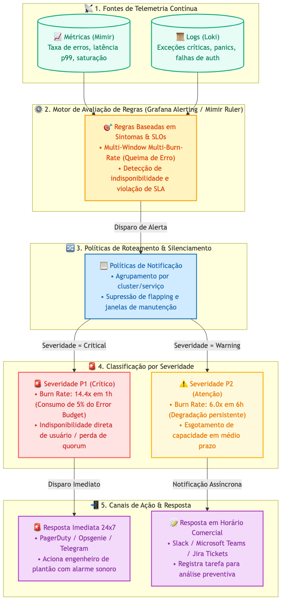
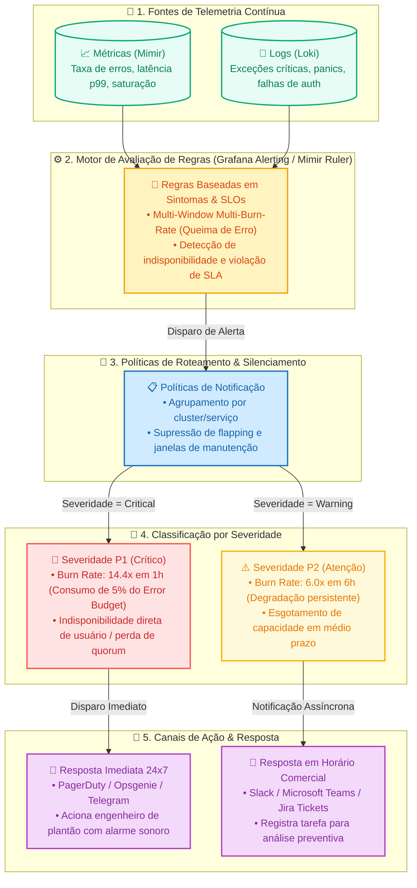

# Estratégia de Alertas e Notificações (Alerting)

> **Referência Técnica:** Este documento estabelece a estratégia conceitual e a arquitetura de regras de alerta e políticas de notificação para a LGTM Stack.

---

## 1. Introdução

Sistemas tradicionais de alertas frequentemente sofrem de **fadiga de alarmes (Alert Fatigue)**: centenas de notificações disparadas por picos momentâneos de CPU ou memória que se normalizam sozinhos em poucos segundos. Isso faz com que equipes ignorem mensagens e percam incidentes reais.

A LGTM Stack adota a estratégia moderna de **Alertas Baseados em Sintomas Reais e Queima de SLOs (*Multi-Window Multi-Burn-Rate Alerts*)**, garantindo que engenheiros sejam acionados exclusivamente quando há risco iminente ou quebra de serviço para os usuários.

---

## 2. Objetivo

1. **Eliminar Alertas Ruidosos:** Alertar por impacto de negócio e sintomas (taxa de erros e latência) em vez de causas isoladas de hardware.
2. **Priorizar Notificações por Severidade:** Separar o que exige acordar um engenheiro (P1 Crítico) do que pode ser tratado no dia seguinte em horário comercial (P2 Atenção).
3. **Integrar Alertas com os Dashboards:** Assegurar que os limites visuais (*thresholds*) dos painéis em `Health` correspondam exatamente às regras de disparo.

---

## 3. Arquitetura de Alertas

O pipeline de avaliação de regras, agrupamento de políticas e acionamento de canais de resposta é estruturado da seguinte forma:

📐 Exibir código-fonte Mermaid do diagrama

---

## 4. Classificação por Severidade e Taxa de Queima (*Burn Rate*)

Conforme detalhado na metodologia de observabilidade ([OBSERVABILITY-METHODOLOGY.md](OBSERVABILITY-METHODOLOGY.md)), as regras operam sobre janelas móveis de tempo:

| Nível | Condição de Disparo | O que Significa | Canal e Ação |
|---|---|---|---|
| **🚨 Crítico (P1)** | Queima de **14.4x** em 1 hora | O sistema consumiu **5% do orçamento de erro em 1 hora**. Se não for contido, causará indisponibilidade massiva no dia. | Notificação sonora imediata (On-Call / Pager / Telegram). |
| **⚠️ Atenção (P2)** | Queima de **6.0x** em 6 horas | Degradação persistente que consumiu 5% do orçamento em 6 horas. | Mensagem no canal de equipe (Slack / Teams / Ticket). |
| **ℹ️ Info / Normal** | Queima de **≤ 1.0x** | Operação saudável e dentro do planejado. | Sem notificação (registrado apenas em painel). |

---

## 5. Status de Implementação e Roadmap

* **Status Atual:** Baseline de métricas e dashboards operacionais 100% integrados. Regras de alerta padrão estão sendo formalizadas como código no Grafana Provisioning.
* **Próximas Entregas:** Regras unificadas para detecção de queda de nós, saturação de discos e quebra de latência em serviços de banco de dados e DNS.

---

## 6. Governança e Referências

* Para a metodologia conceitual de SLIs, SLOs e Error Budgets, consulte [OBSERVABILITY-METHODOLOGY.md](OBSERVABILITY-METHODOLOGY.md).
* Para a política de métricas e allowlists, consulte [METRICS.md](METRICS.md).
* Para o roadmap de evolução da stack, consulte [ROADMAP.md](../ROADMAP.md).

---
🔙 Voltar: [README Principal](../README.md)
