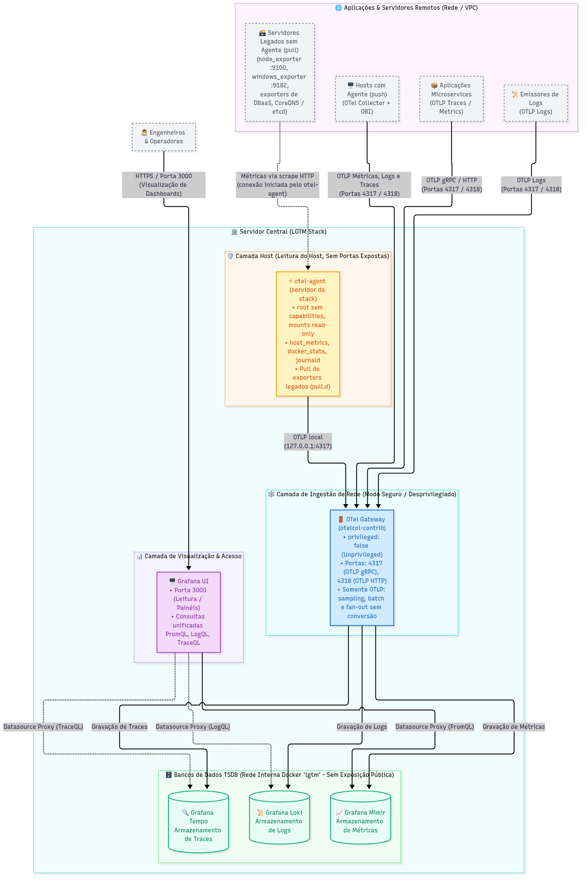
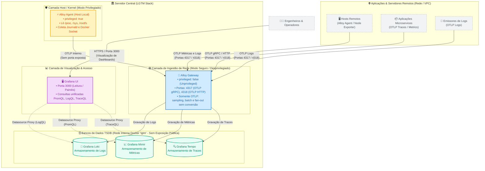

# Arquitetura Física e Lógica (LGTM Stack)

> **Referência Técnica:** Este documento descreve a topologia de rede, o isolamento de segurança e as responsabilidades arquiteturais de cada componente da LGTM Stack.

---

## 1. Introdução

Em arquiteturas convencionais de observabilidade, o coletor de telemetria é frequentemente configurado como um único processo com privilégios de administrador (`root`) para inspecionar o sistema operacional e, ao mesmo tempo, exposto diretamente à rede externa para receber dados de aplicações. Esse modelo cria uma vulnerabilidade crítica de segurança.

A LGTM Stack elimina esse risco através do desacoplamento em dois papéis fundamentais: o **Alloy Agent** (coleta local segura) e o **Alloy Gateway** (ingestão e roteamento desprivilegiado).

---

## 2. Objetivo

1. **Garantir Isolamento de Segurança:** Impedir que processos com privilégios elevados fiquem expostos a conexões de rede externa.
2. **Definir Fronteiras de Rede:** Centralizar toda a ingestão da stack em um único componente sem privilégios (Gateway).
3. **Proteger os Bancos de Dados (TSDBs):** Manter Loki, Mimir e Tempo totalmente isolados da rede pública, permitindo leitura exclusivamente através do Grafana.

---

## 3. Topologia Geral (Padrão Gateway-Agent)

A divisão de responsabilidades entre coleta no host e recepção na rede é estruturada através do desacoplamento de privilégios e isolamento de segurança:



<details>
<summary>📐 Exibir código-fonte Mermaid do diagrama</summary>


</details>

---

## 4. Componentes e Papéis da Stack

### 4.1 Alloy Gateway (Ingestão e Roteamento)
Roda sem privilégios elevados e atua como o **ponto único de entrada** para toda a telemetria que chega pela rede:
* **Portas 4317 (gRPC) e 4318 (HTTP):** Única entrada da stack — traces, métricas e logs no padrão OpenTelemetry (OTLP), vindos dos Alloy Agents e das aplicações.
* **Roteamento:** Encaminha cada sinal ao seu backend em **OTLP nativo**: métricas → Mimir (`/otlp/v1/metrics`), logs → Loki (`/otlp/v1/logs`), traces → Tempo (gRPC). O Gateway não converte nem renomeia dados: só aplica `memory_limiter`, tail sampling de traces e `batch` (`alloy-gateway/conf.d/003-otlp-gtw-local.alloy` e `999-outputs.alloy`).

> ⚠️ **Regras Arquiteturais Invioláveis:**
> 1. **Só o Alloy Gateway escreve nos backends.** Agentes, aplicações e os próprios backends nunca escrevem direto em `mimir:9009`, `loki:3100` ou `tempo:4317`.
> 2. **Cada backend armazena apenas o seu sinal** (métricas → Mimir, logs → Loki, traces → Tempo). Por isso o `metrics_generator` do Tempo fica desabilitado.
> 3. **O dado sai da origem já correto**: OTLP com a [OTel Semantic Conventions](https://opentelemetry.io/docs/specs/semconv/). Conversões acontecem no Alloy Agent, nunca no Gateway.

Verificação de que só há escrita OTLP nos backends (contadores por rota, rede interna `lgtm`):

```bash
docker run --rm --network lgtm curlimages/curl -s http://mimir:9009/metrics \
  | grep -E 'cortex_request_duration_seconds_count\{.*route="(api_v1_push|otlp_v1_metrics)"'   # só otlp_v1_metrics
docker run --rm --network lgtm curlimages/curl -s http://loki:3100/metrics \
  | grep -E 'loki_request_duration_seconds_count\{.*route="(loki_api_v1_push|otlp_v1_logs)"'    # só otlp_v1_logs
```

### 4.2 Alloy Agent (Coleta Local no Host)
Roda com permissões administrativas (`privileged: true`) para inspecionar o estado do sistema operacional e contêineres:
* Lê `/proc`, `/sys` e `/rootfs` para extrair métricas de CPU, memória, disco e rede.
* Lê os arquivos de log do systemd journal e do socket Docker.
* Não expõe nenhuma porta de recebimento na rede pública — envia tudo via push interno para o Gateway.

### 4.3 Backends Distroless (Loki, Mimir e Tempo)
As bases de dados utilizam imagens *distroless* (sem shell e sem utilitários de sistema operacional desnecessários):
* Não possuem portas publicadas no host — são acessíveis exclusivamente dentro da rede interna Docker `lgtm`.
* Não utilizam healthcheck baseado em `CMD-SHELL`.
* Para procedimentos de upgrade e verificação de saúde, consulte [UPGRADE.md](UPGRADE.md).

### 4.4 Grafana (Camada de Visualização)
* É o único ponto de consulta e leitura de dados para os usuários e operadores.
* Conecta-se internamente aos backends (Mimir, Loki, Tempo) através dos datasources provisionados como código.

---

## 5. Requisitos de Firewall e Portas de Rede

Para permitir que agentes remotos enviem dados e os operadores acessem os painéis, configure as seguintes regras no firewall do host (`ufw`/`iptables`) e no Security Group da nuvem (Magalu Cloud, AWS, etc.):

| Porta | Protocolo | Origem Recomendada | Descrição do Serviço |
|---|---|---|---|
| **`3000`** | TCP | Pública (Internet / VPN) | Acesso à interface web do **Grafana**. |
| **`12345`** | TCP | VPN / Admin | Acesso à interface web de diagnóstico do **Alloy Gateway**. |
| **`4317`** | TCP | Rede Interna (VPC / VPN) | Ingestão OTLP gRPC (traces, métricas e logs de agents e aplicações). |
| **`4318`** | TCP | Rede Interna (VPC / VPN) | Ingestão OTLP HTTP (traces, métricas e logs de agents e aplicações). |

> 🔒 **Recomendação de Segurança:** Nunca abra as portas de ingestão (`4317`, `4318`) diretamente para a internet aberta. O tráfego de telemetria entre servidores remotos e a stack central deve trafegar através de VPN, VPC Peering ou túneis criptografados.

---

## 6. Governança e Referências

* Para dimensionamento de hardware e disco, consulte [SIZING.md](SIZING.md).
* Para a metodologia e taxonomia de organização de painéis, consulte [OBSERVABILITY-METHODOLOGY.md](OBSERVABILITY-METHODOLOGY.md).
* Para procedimentos de backup e recuperação, consulte [BACKUP.md](BACKUP.md).

---
🔙 Voltar: [README Principal](../README.md)
