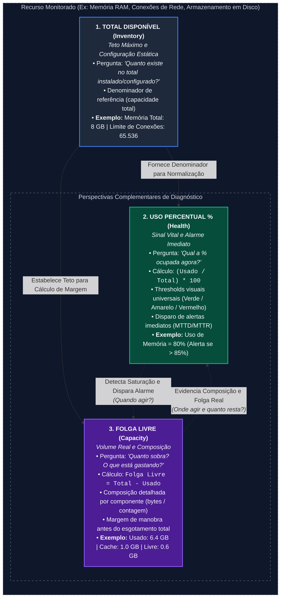

# Metodologia de Observabilidade

> **Referência Conceitual:** Este documento estabelece a metodologia e taxonomia agnóstica de visualização, correlação de sinais e confiabilidade (SRE) para plataformas de observabilidade (como Grafana, Datadog, Dynatrace, Elastic, New Relic, Prometheus, entre outras). Trata-se de um modelo conceitual sobre **como estruturar, correlacionar e consumir telemetria de forma eficiente**, independente da tecnologia ou ferramenta empregada.

---

## 1. Introdução

Em qualquer ecossistema moderno de observabilidade, um problema recorrente é o **desalinhamento na categorização dos dados**: gráficos com métricas corretas, mas agrupados no local inadequado. Isso obriga engenheiros de software, operadores e equipes de suporte a perder tempo precioso procurando informações vitais durante incidentes.

Para evitar que painéis se tornem paredes de números caóticas, esta taxonomia define um propósito claro para cada compartimento visual. O modelo estabelece que cada sinal de telemetria deve responder a uma pergunta específica, no momento exato em que essa pergunta precisa ser feita.

---

## 2. Objetivo

1. **Padronização Conceitual:** Garantir que qualquer visualização (seja de infraestrutura básica, bancos de dados, clusters de contêineres ou microsserviços) siga rigorosamente a mesma hierarquia mental de diagnóstico.
2. **Otimização do Tempo de Resposta (MTTD/MTTR):** Separar com precisão os sinais vitais imediatos dos indicadores de capacidade e das métricas profundas de causa raiz.
3. **Critério Universal para Novos Indicadores:** Fornecer um método reprodutivo e agnóstico para enquadrar qualquer novo indicador técnico em seu pilar correto.

---

## 3. Conceito Central: Total, Uso em % e Folga Livre

Qualquer recurso monitorado (memória física, conexões de rede, capacidade de processamento, armazenamento em disco ou filas de mensagens) é descrito por três perspectivas fundamentais que se complementam:



> 🖼️ *Diagrama conceitual: [SVG Vetorial](diagrams/observability-pillars-relationship.svg) · [PNG Raster](diagrams/observability-pillars-relationship.png) · [Fonte Mermaid](diagrams/observability-pillars-relationship.mmd)*

| Papel | Pergunta que responde | Pilar | Exemplo Conceitual |
|---|---|---|---|
| **1. Total Disponível** | "Quanto existe no total configurado?" | **Inventory** | `Capacidade Total: 8 GB`, `Limite de Conexões: 65.536` |
| **2. Uso Percentual (%)** | "Qual a porcentagem ocupada agora?" | **Health** | `Uso de Memória: 80%`, `Utilização de CPU: 12%` |
| **3. Consumo e Folga (Total − Usado)** | "O que está gastando e quanto resta livre?" | **Capacity** | `Memória por Tipo (bytes)`, `Conexões: Abertas vs Limite Total` |

### Por que essa separação é mandatória?

1. **Alertas e Limites de Perigo pertencem ao Health (%):**
   * Percentuais são universais e portáteis entre ambientes heterogêneos. Uma regra de *"Uso acima de 90%"* é válida tanto em um contêiner pequeno de 512 MB quanto em um cluster de 1 TB. Valores absolutos não são portáteis (um alerta fixo em bytes só serviria para um único tamanho de máquina).
   * Thresholds e cores de alarme (verde/amarelo/vermelho) devem viver exclusivamente no Health.

2. **Capacity evidencia a Folga Real (Total − Consumido):**
   * Enquanto o **Health** emite o sinal de alarme em porcentagem, o **Capacity** detalha o consumo em unidades reais (bytes, contagens, conexões, buffers), permitindo enxergar a distância física restante até o teto.
   * Ele responde: *"Quanto tempo e espaço temos antes de esgotar o recurso?"* e *"Qual componente ou subsistema está consumindo a maior fatia?"*.

3. **Inventory estabelece o Teto Máximo:**
   * Registra a capacidade total contratada, parâmetros estáticos e limites físicos que não oscilam no dia a dia operacional.

---

## 4. Os 5 Pilares de Métricas

| # | Pilar | Pergunta que responde | Unidade Típica | Foco Operacional |
|---|---|---|---|---|
| **4.1** | **Health** | "O serviço está saudável e disponível agora?" | `%` normalizado ou status binário | Sinais vitais e alarmes de emergência |
| **4.2** | **Capacity** | "O que está consumindo e quanto sobra livre (Total − Usado)?" | Absoluto (bytes, contagem, conexões) | Planejamento, composição e folga |
| **4.3** | **Activity** | "Quanto trabalho está passando pelo sistema?" | Taxa temporal (`/s`, `ops/sec`, `reqps`) | Volume de tráfego e vazão de operações |
| **4.4** | **Diagnostics** | "Por que quebrou, e por onde começo a investigar?" | Erros específicos, latência, saturação | Causa raiz e análise profunda |
| **4.5** | **Inventory** | "O que está rodando, em qual versão e com qual teto?" | Texto, constantes, datas e versões | Metadados de ambiente e limites fixos |

---

### 4.1 Health — Sinais Vitais e Saúde Imediata

Mede o estado de operação **neste instante**, normalizado em porcentagem (`%`) ou status binário (`UP/DOWN`). É o primeiro local consultado durante um incidente para responder à pergunta *"o sistema está degradado?"*.

* **Em Nível de Infraestrutura / Máquinas:**
  * Sinais vitais de hardware: CPU, memória, disco e rede.
  * Exemplos: `Utilização de CPU (%)`, `Utilização de Memória (%)`, `Uso de Disco (%)`, `Vazão de Rede`.
* **Em Nível de Aplicação / Serviço:**
  * Disponibilidade do processo + saturação de conexões + taxa geral de erros + latência no topo (p99).
  * Exemplos: `Status Operacional (UP/DOWN)`, `Taxa Geral de Erros (%)`, `Latência p99`, `Saúde de Dependências Externas`.

> **Teste Rápido:** *É um sinal vital rápido cujo limite de perigo funciona de forma idêntica em qualquer tamanho de ambiente?* → **Health**.

---

### 4.2 Capacity — Composição do Consumo e Folga Livre (Total − Usado)

Exibe, em **unidades absolutas e detalhadas por componente**, o consumo real dos recursos e a **folga restante até o limite máximo (`Total − Consumido`)**. Serve para responder *"o que exatamente está ocupando espaço?"* e planejar expansões antes que ocorra a indisponibilidade.

* **Exemplos Conceituais:**
  * `Memória por Segmento (bytes)` (Alocado pela Aplicação vs. Cache de Sistema vs. Buffer vs. Livre)
  * `Conexões de Rede / Sockets` (Conexões Ativas vs. Limite Máximo Suportado)
  * `Armazenamento em Disco` (Espaço Utilizado vs. Espaço Disponível)
  * `Tamanho do Banco de Dados / Filas` (Volume Físico Armazenado)
  * `Entradas em Memória Cache` (Registros Armazenados vs. Teto do Pool)

> **Teste Rápido:** *Mostra o recurso em unidades reais (bytes/contagem), aberto por componente e evidenciando a folga livre (Total − Usado)?* → **Capacity**.

---

### 4.3 Activity — Volume e Trabalho em Andamento

Mede a taxa de execução e o volume de requisições que atravessam o sistema ao longo do tempo. O Activity **não expressa julgamento de valor (bom ou ruim)** — uma oscilação aqui representa contexto de demanda de negócio, não necessariamente um defeito.

* **Exemplos Conceituais:**
  * `Operações de E/S de Disco (IOPS e Throughput em bytes/s)`
  * `Vazão de Tráfego de Rede (bytes/s)`
  * `Taxa de Requisições / Consultas por Segundo (req/s)`
  * `Transações Executadas por Segundo (ops/sec)`
  * `Operações de Leitura e Escrita em Cache (req/s)`

> **Teste Rápido:** *Mede a taxa ou volume de trabalho passando pelo sistema ao longo do tempo?* → **Activity**.

---

### 4.4 Diagnostics — Investigação e Causa Raiz

Reúne indicadores especializados e métricas de segunda ordem para investigação técnica **após** o Health indicar que há um problema. É o pilar que responde *"por que o sistema falhou?"*.

* **Exemplos Conceituais:**
  * `Contadores de Crashes e Falhas Críticas de Software`
  * `Erros Decompostos por Tipo e Código de Falha (ex: Timeout, Falha de Banco, Bloqueio)`
  * `Decomposição de Latência por Rota, Backend ou Dependência Externa`
  * `Eficiência de Cache (Hit Rate %) e Descartes Prematuros de Memória`
  * `Pressão de Recursos (Saturação de CPU, Espera de I/O, Fila de Threads)`

> **Teste Rápido:** *Este gráfico só é relevante quando alguém já está investigando a causa de um incidente?* → **Diagnostics**.

---

### 4.5 Inventory — Constantes, Limites Máximos e Identidade

Registra as informações cadastrais do ambiente e os **tetos máximos de dimensionamento**. São dados que mudam apenas durante manutenções programadas, atualizações de versão ou reconfiguração de infraestrutura.

* **Exemplos Conceituais:**
  * **Totais e Tetos:** `Capacidade Total de CPU`, `Memória Física Total`, `Espaço Total de Armazenamento`, `Limite Máximo de Conexões/Sockets`.
  * **Identidade e Versões:** `Sistema Operacional / Plataforma`, `Versão do Software`, `Commit / Build ID`, `Tempo de Atividade (Uptime)`, `Módulos e Recursos Habilitados`.

> **Teste Rápido:** *O valor só se altera quando alguém faz deploy ou reconfigura a infraestrutura?* → **Inventory**.

---

## 5. Sinais Especiais: Logs e Traces

Logs e Traces **não são uma subdivisão de Diagnostics**. Eles representam tipos fundamentais de sinais de telemetria com formatos textuais e estruturais próprios, exigindo compartimentos visuais dedicados:

```mermaid
flowchart TB
    %% Separação Fundamental dos Sinais de Telemetria
    subgraph TelemetryModel ["Taxonomia Fundamental dos Sinais de Observabilidade"]
        direction TB

        subgraph MetricsDomain ["1. SINAIS MÉTRICOS / SÉRIES TEMPORAIS (TSDB)"]
            direction TB
            MetricsFocus["<b>Foco Operacional:</b> Dados Numéricos Agregados ao Longo do Tempo<br/><i>Responde: <b>SE</b> e <b>QUANDO</b> há problemas de degradação ou saturação</i>"]

            subgraph MetricsPillars ["Pilares de Métricas"]
                direction LR
                Health["<b>HEALTH</b><br/><i>Sinais Vitais e Alarmes</i><br/>• Uso percentual (%) e status binário<br/>• Limiares universais (Verde/Amarelo/Vermelho)<br/>• <b>Exemplos:</b> CPU %, Memória %, Latência p99"]
                Capacity["<b>CAPACITY</b><br/><i>Composição e Folga Livre</i><br/>• Unidades absolutas (Total - Usado)<br/>• Prevenção de exaustão e dimensionamento<br/>• <b>Exemplos:</b> Bytes alocados, Conexões ativas"]
                Activity["<b>ACTIVITY</b><br/><i>Volume e Trabalho</i><br/>• Taxa de transferência e vazão temporal<br/>• Contexto de demanda do negócio (/s)<br/>• <b>Exemplos:</b> IOPS, Throughput, Req/s, Ops/s"]
                Diagnostics["<b>DIAGNOSTICS</b><br/><i>Causa Raiz e Análise</i><br/>• Indicadores de segunda ordem e contadores<br/>• Investigação aprofundada pós-alerta<br/>• <b>Exemplos:</b> Falhas por código, Espera de I/O"]
            end
            MetricsFocus --> MetricsPillars
        end

        subgraph EventsDomain ["2. SINAIS DE EVENTOS E FLUXO DISTRIBUÍDO"]
            direction TB
            EventsFocus["<b>Foco Investigativo:</b> Evidências Detalhadas e Correlação Estruturada<br/><i>Responde: <b>ONDE</b> e <b>COMO</b> a falha ocorreu no ecossistema</i>"]

            subgraph EventsPillars ["Compartimentos Dedicados"]
                direction LR
                Logs["<b>LOGS</b><br/><i>Eventos Textuais Estruturados</i><br/>• Linhas de log enriquecidas e estruturadas<br/>• Filtro por contexto e severidade em tempo real<br/>• <b>Categorias:</b> Segurança, Sistema, Aplicação, Negócio"]
                Traces["<b>TRACES</b><br/><i>Fluxo Ponta a Ponta e Spans</i><br/>• Transações distribuídas (OpenTelemetry)<br/>• Grafo de dependências e latência por span<br/>• <b>Visão:</b> Rastreamento completo entre microsserviços"]
            end
            EventsFocus --> EventsPillars
        end

        %% Correlação entre os dois mundos
        MetricsDomain -.->|"<b>Detecção:</b> Alertas delimitam anomalias e janela temporal"| EventsDomain
        EventsDomain -.->|"<b>Diagnóstico:</b> Spans e logs isolam a linha de código e causa exata"| MetricsDomain
    end

    %% Estilização Visual Profissional
    classDef containerStyle fill:#0b0f19,stroke:#475569,stroke-width:1px,stroke-dasharray: 5 5,color:#e2e8f0;
    classDef domainStyle fill:#0f172a,stroke:#3b82f6,stroke-width:1.5px,color:#f8fafc;
    classDef domainEventsStyle fill:#0f172a,stroke:#ec4899,stroke-width:1.5px,color:#f8fafc;
    classDef focusMetricsStyle fill:#1e293b,stroke:#60a5fa,stroke-width:1.5px,color:#f1f5f9;
    classDef focusEventsStyle fill:#1e293b,stroke:#f472b6,stroke-width:1.5px,color:#f1f5f9;
    classDef healthStyle fill:#064e3b,stroke:#10b981,stroke-width:2px,color:#f8fafc;
    classDef capacityStyle fill:#4c1d95,stroke:#8b5cf6,stroke-width:2px,color:#f8fafc;
    classDef activityStyle fill:#1e3a8a,stroke:#38bdf8,stroke-width:2px,color:#f8fafc;
    classDef diagnosticsStyle fill:#831843,stroke:#f43f5e,stroke-width:2px,color:#f8fafc;
    classDef logsStyle fill:#78350f,stroke:#f59e0b,stroke-width:2px,color:#f8fafc;
    classDef tracesStyle fill:#134e4a,stroke:#14b8a6,stroke-width:2px,color:#f8fafc;

    class TelemetryModel,MetricsPillars,EventsPillars containerStyle;
    class MetricsDomain domainStyle;
    class EventsDomain domainEventsStyle;
    class MetricsFocus focusMetricsStyle;
    class EventsFocus focusEventsStyle;
    class Health healthStyle;
    class Capacity capacityStyle;
    class Activity activityStyle;
    class Diagnostics diagnosticsStyle;
    class Logs logsStyle;
    class Traces tracesStyle;
```



> 🖼️ *Diagrama conceitual: [SVG Vetorial](diagrams/telemetry-signals-classification.svg) · [PNG Raster](diagrams/telemetry-signals-classification.png) · [Fonte Mermaid](diagrams/telemetry-signals-classification.mmd)*

---

### 5.1 Categorização Estruturada de Logs

Para que a aba de **Logs** seja eficiente e não se torne um repositório desorganizado de mensagens, os logs devem ser categorizados em 4 contextos funcionais bem definidos:

```text
  ┌─────────────────────────────────────────────────────────────────────────────┐
  │                            CATEGORIAS DE LOGS                               │
  ├───────────────────┬───────────────────┬───────────────────┬─────────────────┤
  │ 1. SEGURANÇA      │ 2. SISTEMA        │ 3. APLICAÇÃO      │ 4. ERROS NEGÓCIO│
  │ Autenticação,     │ SO, Kernel,       │ Código, Runtimes, │ Regras de       │
  │ Acessos e Auditoria│ Daemons e Hardware│ Exceções e Banco  │ Domínio e Falhas│
  └───────────────────┴───────────────────┴───────────────────┴─────────────────┘
```

#### 1. Segurança (Security / Auth / Audit)
* **O que é:** Registros de autenticação, autorização, auditoria de acesso e controle de perímetro de segurança.
* **O que colocar:**
  * Tentativas de login bem-sucedidas e falhas (SSH, RDP, painéis web, consoles administrativos).
  * Elevação de privilégios (`sudo`, troca de usuários).
  * Alterações de credenciais, certificados e chaves de acesso.
  * Bloqueios de firewall, ACLs de rede ou regras de WAF.
  * Falhas de autenticação de API, tokens expirados ou assinaturas inválidas.
* **O que observar:**
  * Ataques de força bruta (múltiplas falhas consecutivas de login).
  * Logins fora do horário habitual de expediente ou vindos de IPs geográficos anômalos.
  * Múltiplas tentativas de acesso negado a recursos sensíveis ou arquivos protegidos.

#### 2. Sistema (System / Kernel / OS / Daemons)
* **O que é:** Eventos gerados pelo sistema operacional, kernel, gerenciadores de serviços e subsistemas de hardware.
* **O que colocar:**
  * Mensagens de boot, shutdown e recarga do sistema.
  * Eventos do Kernel (`dmesg`), mensagens de pânico e acionamento do *OOM Killer* (processos encerrados por falta de memória).
  * Falhas de inicialização ou parada inesperada de serviços de sistema (`systemd`, `Windows Services`).
  * Eventos de montagem, desmontagem ou corrupção de sistema de arquivos (*filesystem* em modo `read-only`).
  * Tarefas agendadas periódicas (`cron`, `Task Scheduler`).
* **O que observar:**
  * Intervenções do OOM Killer derrubando processos críticos da aplicação.
  * Mensagens de erro de I/O em disco ou setores danificados.
  * Daemons de infraestrutura reiniciando em loop (*crash looping*).

#### 3. Aplicação (Application / Runtime / Framework)
* **O que é:** Logs gerados pelo código-fonte dos serviços, frameworks web, runtimes (Node.js, Go, Python, Java, .NET) e servidores de banco de dados/mensageria.
* **O que colocar:**
  * Ciclo de vida da aplicação (inicialização de workers, portas em escuta, encerramento gracioso).
  * Exceções não tratadas (*Unhandled Exceptions*), *stack traces* e erros de compilação/interpretação.
  * Consultas lentas de banco de dados (*slow queries*) e falhas de conexão com bancos ou caches.
  * Erros de comunicação de rede, conexões recusadas (*connection refused*) e timeouts entre microsserviços.
* **O que observar:**
  * Aumento repentino na taxa de mensagens com severidade `ERROR` ou `FATAL`.
  * Repetição contínua da mesma stack trace de erro após um novo deploy.
  * Timeouts em cascata causados pela lentidão de uma dependência externa.

#### 4. Erros de Negócio (Business Errors / Domain Logic)
* **O que é:** Eventos que indicam violações de regras de negócio ou falhas lógicas no fluxo do produto, **mesmo quando toda a infraestrutura técnica está 100% saudável**.
* **O que colocar:**
  * Tentativas de compra recusadas por saldo insuficiente, cartão expirado ou falha de limite.
  * Pedidos bloqueados por regras de risco ou mecanismos antifraude.
  * Divergências de estoque, produtos indisponíveis ou tentativas de compras com preços inconsistentes.
  * Recusas de resposta de gateways de pagamento externos ou parceiros de logística.
  * Violações de regras de validação cadastral ou contratos de dados de clientes.
* **O que observar:**
  * Queda anormal na taxa de conclusão de compras ou cadastros.
  * Aumento expressivo de transações bloqueadas pelo antifraude (possível falso positivo prejudicando clientes legítimos).
  * Aumento repentino de chamadas rejeitadas por validação de esquema de payload após lançamento de novas features.

---

### 5.2 Traces — Fluxo Distribuído e Rastreamento Ponta a Ponta

* **O que é:** O rastreamento distribuído (*Distributed Tracing*) decompõe cada requisição em uma árvore hierárquica de etapas menores denominadas **Spans**.
* **O que colocar:**
  * Tempo de trânsito em chamadas HTTP/gRPC entre serviços.
  * Duração e parâmetros de execução de queries SQL/NoSQL.
  * Tempo de processamento em filas e brokers de mensagens (NATS, Kafka, RabbitMQ).
  * Contexto de correlação universal (`trace_id` e `span_id`) propagado nos cabeçalhos das requisições.
* **O que observar:**
  * O "efeito gargalo": identificar com precisão cirúrgica qual microsserviço ou query específica foi responsável por 80% do tempo de resposta da transação do cliente.
  * Spans marcados com erro ou status `HTTP 5xx`, permitindo saltar diretamente da visualização do Trace para a linha de Log exata daquele momento.

---

### 5.3 Correlação e Navegação entre Sinais (Métricas, Traces e Logs)

A verdadeira maturidade de observabilidade reside na **capacidade de transição fluida entre os 3 sinais** sem perda de contexto operacional. A jornada de investigação reduz o MTTD e MTTR ao conectar diretamente a detecção da anomalia à sua causa raiz:

```mermaid
flowchart TB
    %% =========================================================================
    %% Diagrama: Correlação e Navegação entre os 3 Sinais da Observabilidade
    %% Documento: docs/OBSERVABILITY-METHODOLOGY.md
    %% =========================================================================

    subgraph ObservabilityPillars ["Correlação e Navegação entre Sinais de Telemetria (Métricas, Traces e Logs)"]
        direction TB

        %% ---------------------------------------------------------------------
        %% 1. DOMÍNIO DE MÉTRICAS
        %% ---------------------------------------------------------------------
        subgraph MetricsDomain ["1. MÉTRICAS — Detecção & Alarme ('SE e QUANDO quebrou?')"]
            direction TB
            MetricsInfo["<b>Objetivo:</b> Identificar anomalias e delimitar a janela temporal do incidente<br/><i>Foco: Séries temporais numéricas contínuas e agregações estatísticas</i>"]

            subgraph MetricsComponents ["Visão de Painéis de Métricas (Mimir / PromQL)"]
                direction LR
                Alerts["<b>Alertas & SLOs</b><br/>• Disparo via Alertmanager<br/>• Violação de limiares (Health)<br/>• Saturação e aumento de erro %"]
                TimeSeries["<b>Gráfico de Séries Temporais</b><br/>• Latência p95/p99 e Throughput<br/>• Ponto de pico e anomalia temporal<br/>• Janela exata da ocorrência"]
                Exemplars["<b>Pontos com Exemplars</b><br/>• Amostras de alta latência ou erro<br/>• Metadado embutido: <code>TraceID</code><br/>• Link direto para o rastreamento"]
            end
            MetricsInfo --> MetricsComponents
            Alerts --> TimeSeries
            TimeSeries --> Exemplars
        end

        %% ---------------------------------------------------------------------
        %% 2. DOMÍNIO DE TRACES
        %% ---------------------------------------------------------------------
        subgraph TracesDomain ["2. TRACES — Localização & Contexto ('ONDE e QUAL COMPONENTE quebrou?')"]
            direction TB
            TracesInfo["<b>Objetivo:</b> Isolar o microsserviço, dependência ou query responsável pelo gargalo/falha<br/><i>Foco: Fluxo distribuído ponta a ponta e cascata de latência</i>"]

            subgraph TracesComponents ["Visão de Rastreamento Distribuído (Grafana Tempo)"]
                direction LR
                ServiceGraph["<b>Grafo de Serviços</b><br/>• Topologia ponta a ponta<br/>• Relação cliente-servidor<br/>• Taxa de erro por dependência"]
                TraceWaterfall["<b>Árvore de Spans (Waterfall)</b><br/>• Caminho crítico da requisição<br/>• Duração por etapa / chamada<br/>• Destaque no span com erro (5xx)"]
                SpanDetails["<b>Detalhes do Span</b><br/>• <code>trace_id</code> e <code>span_id</code><br/>• Tags, atributos HTTP/DB<br/>• Status OpenTelemetry <code>ERROR</code>"]
            end
            TracesInfo --> TracesComponents
            ServiceGraph --> TraceWaterfall
            TraceWaterfall --> SpanDetails
        end

        %% ---------------------------------------------------------------------
        %% 3. DOMÍNIO DE LOGS
        %% ---------------------------------------------------------------------
        subgraph LogsDomain ["3. LOGS — Evidência & Causa Raiz ('POR QUE quebrou?')"]
            direction TB
            LogsInfo["<b>Objetivo:</b> Revelar a mensagem textual exata, stack trace e variáveis de erro<br/><i>Foco: Eventos discretos estruturados e contextualizados</i>"]

            subgraph LogsComponents ["Visão de Eventos Estruturados (Grafana Loki)"]
                direction LR
                LogStreams["<b>Streams Filtrados</b><br/>• Labels: <code>service_name</code>, <code>host_name</code><br/>• Filtro por severidade (<code>severity_text=#quot;ERROR#quot;</code>)<br/>• Alinhamento na janela temporal"]
                LogDetails["<b>Linha de Log & Stack Trace</b><br/>• Exceção detalhada do runtime<br/>• Query SQL exata / Payload de falha<br/>• Causa raiz definitiva do incidente"]
                LogCorrelation["<b>Campos de Correlação</b><br/>• Tags estruturadas no JSON<br/>• <code>trace_id: 4bf92f35...</code><br/>• <code>span_id: 00f067aa...</code>"]
            end
            LogsInfo --> LogsComponents
            LogStreams --> LogDetails
            LogDetails --> LogCorrelation
        end

        %% ---------------------------------------------------------------------
        %% RELAÇÕES E MECANISMOS DE INTEGRAÇÃO / CORRELAÇÃO
        %% ---------------------------------------------------------------------
        Exemplars ==>|"<b>1. Exemplar Click (TraceID)</b><br/><i>Salta da anomalia temporal direto para a transação</i>"| TraceWaterfall
        SpanDetails ==>|"<b>2. Trace to Logs (TraceID + SpanID)</b><br/><i>Abre apenas os logs emitidos durante aquele span</i>"| LogDetails
        LogCorrelation -.->|"<b>3. Logs to Trace (Busca Reversa)</b><br/><i>Localiza o trace a partir do trace_id no log</i>"| TraceWaterfall
        TimeSeries -.->|"<b>4. Data Link de Contexto</b><br/><i>Navega por janela temporal, host e service_name</i>"| LogStreams
    end

    %% =========================================================================
    %% ESTILIZAÇÃO VISUAL PROFISSIONAL (Dark Theme Alinhado)
    %% =========================================================================
    classDef containerStyle fill:#0b0f19,stroke:#475569,stroke-width:1.5px,stroke-dasharray: 5 5,color:#e2e8f0;
    classDef domainMetricsStyle fill:#0f172a,stroke:#3b82f6,stroke-width:2px,color:#f8fafc;
    classDef domainTracesStyle fill:#0f172a,stroke:#14b8a6,stroke-width:2px,color:#f8fafc;
    classDef domainLogsStyle fill:#0f172a,stroke:#f59e0b,stroke-width:2px,color:#f8fafc;

    classDef infoMetricsStyle fill:#1e293b,stroke:#60a5fa,stroke-width:1px,color:#f1f5f9;
    classDef infoTracesStyle fill:#1e293b,stroke:#2dd4bf,stroke-width:1px,color:#f1f5f9;
    classDef infoLogsStyle fill:#1e293b,stroke:#fbbf24,stroke-width:1px,color:#f1f5f9;

    classDef alertStyle fill:#831843,stroke:#f43f5e,stroke-width:2px,color:#f8fafc;
    classDef metricStyle fill:#1e3a8a,stroke:#38bdf8,stroke-width:2px,color:#f8fafc;
    classDef exemplarStyle fill:#064e3b,stroke:#10b981,stroke-width:2px,color:#f8fafc;

    classDef serviceGraphStyle fill:#134e4a,stroke:#14b8a6,stroke-width:2px,color:#f8fafc;
    classDef traceWaterfallStyle fill:#0f766e,stroke:#2dd4bf,stroke-width:2px,color:#f8fafc;
    classDef spanDetailStyle fill:#115e59,stroke:#5eead4,stroke-width:2px,color:#f8fafc;

    classDef logStreamStyle fill:#78350f,stroke:#f59e0b,stroke-width:2px,color:#f8fafc;
    classDef logDetailStyle fill:#92400e,stroke:#fbbf24,stroke-width:2px,color:#f8fafc;
    classDef logCorrelationStyle fill:#451a03,stroke:#d97706,stroke-width:2px,color:#f8fafc;

    class ObservabilityPillars,MetricsComponents,TracesComponents,LogsComponents containerStyle;
    class MetricsDomain domainMetricsStyle;
    class TracesDomain domainTracesStyle;
    class LogsDomain domainLogsStyle;

    class MetricsInfo infoMetricsStyle;
    class TracesInfo infoTracesStyle;
    class LogsInfo infoLogsStyle;

    class Alerts alertStyle;
    class TimeSeries metricStyle;
    class Exemplars exemplarStyle;

    class ServiceGraph serviceGraphStyle;
    class TraceWaterfall traceWaterfallStyle;
    class SpanDetails spanDetailStyle;

    class LogStreams logStreamStyle;
    class LogDetails logDetailStyle;
    class LogCorrelation logCorrelationStyle;
```



> 🖼️ *Diagrama conceitual: [SVG Vetorial](diagrams/telemetry-signals-correlation.svg) · [PNG Raster](diagrams/telemetry-signals-correlation.png) · [Fonte Mermaid](diagrams/telemetry-signals-correlation.mmd)*

| Mecanismo de Integração | Origem → Destino | Chave de Ligação | Benefício Operacional |
|---|---|---|---|
| **1. Exemplar Click** | Métricas → Traces | `TraceID` | Salta do ponto de anomalia ou pico no gráfico para a transação exata que causou o desvio. |
| **2. Trace to Logs** | Traces → Logs | `TraceID` + `SpanID` | Abre apenas os logs emitidos no escopo daquele span com erro (eliminando ruído irrelevante). |
| **3. Logs to Trace** | Logs → Traces | `trace_id` (Derived Fields) | Permite reconstituir a jornada completa da requisição a partir de uma linha isolada de log de erro. |
| **4. Data Links de Contexto** | Métricas → Logs | `time_range`, `service.name`, `host.name` | Filtra o stream de logs alinhado à janela temporal e ao host degradado quando não há trace disponível. |

---

## 6. Confiabilidade Orientada a Negócio: SLIs, SLOs e Error Budgets

Os sinais do pilar **Health** alimentam diretamente a gestão de confiabilidade de produto e engenharia (*SRE*), permitindo tomar decisões equilibradas entre **velocidade de entrega de novas funcionalidades** e **estabilidade do ambiente**.

```mermaid
flowchart TD
    %% =========================================================================
    %% Diagrama: Ciclo de Vida de SLIs, SLOs e Error Budget
    %% Documento: docs/OBSERVABILITY-METHODOLOGY.md
    %% =========================================================================

    subgraph ReliabilityFramework ["Ciclo Contínuo de Confiabilidade e Governança de Releases"]
        direction TB

        subgraph MeasurementPhase ["1. MEDIÇÃO CONTÍNUA (Telemetria Real)"]
            direction LR
            SLI["<b>SLI — Indicador de Nível de Serviço</b><br/><i>(Service Level Indicator)</i><br/>• Medição contínua via pilar <b>Health</b><br/>• Proporção de eventos válidos e rápidos<br/>• <b>Fórmula:</b> <code>(Reqs Boas / Reqs Totais) * 100</code><br/>• <b>Exemplo:</b> 99.95% de sucesso (< 200ms)"]
        end

        subgraph ObjectivePhase ["2. COMPROMISSO DE CONFIABILIDADE (Alinhamento de Negócio)"]
            direction LR
            SLO["<b>SLO — Objetivo de Nível de Serviço</b><br/><i>(Service Level Objective)</i><br/>• Meta contratual e operacional de disponibilidade<br/>• Janela temporal móvel (ex: 30 dias)<br/>• <b>Meta Definida:</b> <code>99.9% de disponibilidade</code><br/>• Acordo entre Engenharia e Produto"]
            ErrorBudgetCalc["<b>ERROR BUDGET — Orçamento de Falhas</b><br/><i>(Margem Permitida para Inovação)</i><br/>• Cálculo: <code>100% - SLO = 0.1% de erro permitido</code><br/>• Em 30 dias: ~43.2 minutos de downtime tolerável<br/>• <b>Conceito:</b> 100% de confiabilidade é antieconômico"]
        end

        subgraph BudgetEvaluation ["3. ANÁLISE DO CONSUMO E VELOCIDADE DE QUEIMA (Burn Rate)"]
            direction TB
            DecisionNode{"<b>Estado do Error Budget Restante</b><br/><i>Monitoramento Contínuo de Consumo</i>"}
        end

        subgraph ActionPaths ["4. TOMADA DE DECISÃO E GOVERNANÇA OPERACIONAL"]
            direction LR

            subgraph HealthyBudget ["Budget Saudável (> 20% Restante / Baixo Burn Rate)"]
                direction TB
                InnovationAction["<b>🟢 Foco em Velocidade & Inovação</b><br/>• Liberação de novos deploys e releases frequentes<br/>• Experimentação, testes de carga e novas features<br/>• Assunção calculada de risco operacional<br/>• Engenharia focada em evolução do produto"]
            end

            subgraph DepletedBudget ["Budget Esgotado ou Queima Rápida (≤ 20% / Alto Burn Rate)"]
                direction TB
                StabilityAction["<b>🔴 Foco em Estabilidade & Resiliência</b><br/>• <i>Feature Freeze:</i> Bloqueio de releases de alto risco<br/>• Priorização máxima de correção de bugs e débito técnico<br/>• Refatoração, hardening de infra e melhorias de SLO<br/>• Análise de causa raiz (RCA) e mitigação imediata"]
            end
        end

        %% Fluxos e Relações
        SLI -->|"Alimenta cálculo na janela móvel"| SLO
        SLO -->|"Define margem de tolerância (100% - SLO)"| ErrorBudgetCalc
        ErrorBudgetCalc -->|"Calcula saldo restante e burn rate"| DecisionNode

        DecisionNode -->|"<b>Budget > 20%</b><br/>Risco Aceitável"| InnovationAction
        DecisionNode -->|"<b>Budget ≤ 20% ou Queima Rápida</b><br/>Risco Inaceitável"| StabilityAction

        InnovationAction -.->|"Novos deploys geram novas medições"| SLI
        StabilityAction -.->|"Correções restauram a saúde do serviço"| SLI
    end

    %% Estilização Visual Profissional
    classDef containerStyle fill:#0b0f19,stroke:#475569,stroke-width:1.5px,stroke-dasharray: 5 5,color:#e2e8f0;
    classDef sliStyle fill:#064e3b,stroke:#10b981,stroke-width:2px,color:#f8fafc;
    classDef sloStyle fill:#1e3a8a,stroke:#38bdf8,stroke-width:2px,color:#f8fafc;
    classDef budgetCalcStyle fill:#4c1d95,stroke:#8b5cf6,stroke-width:2px,color:#f8fafc;
    classDef decisionStyle fill:#1e293b,stroke:#f59e0b,stroke-width:2px,color:#f8fafc;
    classDef innovationStyle fill:#064e3b,stroke:#34d399,stroke-width:2px,color:#f8fafc;
    classDef stabilityStyle fill:#831843,stroke:#f43f5e,stroke-width:2px,color:#f8fafc;
    classDef subSectionHealthy fill:#022c22,stroke:#059669,stroke-width:1px,stroke-dasharray: 4 4,color:#a7f3d0;
    classDef subSectionDepleted fill:#4c0519,stroke:#e11d48,stroke-width:1px,stroke-dasharray: 4 4,color:#fecdd3;

    class ReliabilityFramework,MeasurementPhase,ObjectivePhase,BudgetEvaluation,ActionPaths containerStyle;
    class SLI sliStyle;
    class SLO sloStyle;
    class ErrorBudgetCalc budgetCalcStyle;
    class DecisionNode decisionStyle;
    class InnovationAction innovationStyle;
    class StabilityAction stabilityStyle;
    class HealthyBudget subSectionHealthy;
    class DepletedBudget subSectionDepleted;
```



> 🖼️ *Diagrama conceitual: [SVG Vetorial](diagrams/slo-error-budget-lifecycle.svg) · [PNG Raster](diagrams/slo-error-budget-lifecycle.png) · [Fonte Mermaid](diagrams/slo-error-budget-lifecycle.mmd)*

### 6.1 Os Conceitos Fundamentais

1. **SLI (Indicador de Nível de Serviço):** A fórmula matemática que mede a experiência real do usuário (ex: `Requisições Rápidas e com Sucesso / Total de Requisições`).
2. **SLO (Objetivo de Nível de Serviço):** A meta percentual acordada em uma janela móvel (ex: `99.9% nos últimos 30 dias`).
3. **Error Budget (Orçamento de Erro):** A quantidade permitida de falha ($100\% - 99.9\% = 0.1\%$). Em um mês, $0.1\%$ equivale a **~43.2 minutos de instabilidade aceitável**.
4. **Governança de Deploys:**
   * **Budget Positivo (> 20% livre):** O time pode acelerar deploys, lançar novas funcionalidades e assumir riscos controlados.
   * **Budget Esgotado ou Queimando Rápido:** Aciona-se o *Feature Freeze* — suspensão de releases arriscadas para priorizar 100% da engenharia em estabilidade e refatoração.

---

## 7. Governança de Cardinalidade e Princípio Lean

A cardinalidade é a quantidade de combinações únicas de valores que as etiquetas (*labels/tags*) produzem em uma série temporal.

```text
  ┌─────────────────────────────────────────────────────────────────────────────┐
  │                 ONDE ARMAZENAR CADA TIPO DE DADO?                           │
  ├──────────────────────────────────────┬──────────────────────────────────────┤
  │ 1. EM MÉTRICAS (Baixa Cardinalidade) │ 2. EM LOGS E TRACES (Alta Cardinal.) │
  │ Agregações numéricas contínuas       │ Dados detalhados e eventos discretos │
  │ • deployment.environment.name: prd   │ • user_id / account_number           │
  │ • service.name: coredns / auth       │ • trace_id / span_id                 │
  │ • http.response.status_code: 500     │ • payload JSON / query SQL completa  │
  │ • host.name: host-01                 │ • ip_origem_cliente (efêmero)        │
  └──────────────────────────────────────┴──────────────────────────────────────┘
```

### Regras Mandatórias de Eficiência:

1. **Nunca injetar dados de alta cardinalidade em Métricas:** Inserir identificadores únicos (como CPF, email, UUID de transação ou IP do cliente) em labels de métricas provoca uma explosão exponencial de séries temporais, travando o banco de métricas e gerando custos astronômicos de infraestrutura.
2. **Lean Whitelisting:** Em vez de coletar todas as centenas de métricas geradas por exporters, aplique filtros na origem mantendo apenas as séries necessárias para os painéis e alertas. Isso gera uma economia real de **80% a 95% em disco e memória**.

---

## 8. Playbook de Diagnóstico: A Jornada de Resolução em 4 Fases

Durante um incidente, a equipe técnica não deve navegar de forma aleatória. A jornada de resolução segue 4 fases cronológicas e lógicas bem definidas:

```mermaid
flowchart TD
    %% =========================================================================
    %% Diagrama: Jornada de Resolução de Incidentes em 4 Fases
    %% Documento: docs/OBSERVABILITY-METHODOLOGY.md
    %% =========================================================================

    subgraph IncidentJourney ["Jornada de Resolução de Incidentes em 4 Fases (Playbook Mental de Triangulação)"]
        direction TB

        %% FASE 1
        subgraph Phase1 ["FASE 1: DETECÇÃO & ALARME (0s a 30s) — Pilar Health"]
            direction LR
            P1_Trigger["<b>🚨 Disparo do Alerta</b><br/>• Notificação via Alertmanager/Pager<br/>• Violação de SLO / Limiar de Health<br/>• <b>Pergunta:</b> <i>'O sistema está degradado?'</i>"]
            P1_Action["<b>🎯 Identificação do Serviço</b><br/>• Reconhece o serviço/pod afetado<br/>• Normalização de sinais vitais (% e UP/DOWN)<br/>• <b>Exemplo:</b> <code>Taxa de Erro HTTP > 5%</code> ou <code>p99 > 1.5s</code>"]
            P1_Trigger --> P1_Action
        end

        %% FASE 2
        subgraph Phase2 ["FASE 2: CONTEXTO & PRESSÃO (30s a 1m) — Pilares Capacity & Activity"]
            direction LR
            P2_Activity["<b>📈 Análise de Demanda (Activity)</b><br/>• Verifica volume e taxa de entrada<br/>• <b>Pergunta:</b> <i>'Houve pico de tráfego?'</i><br/>• <b>Métricas:</b> Req/s, Throughput, IOPS"]
            P2_Capacity["<b>💾 Análise de Folga (Capacity)</b><br/>• Mede folga livre <code>(Total - Usado)</code><br/>• <b>Pergunta:</b> <i>'Houve exaustão física?'</i><br/>• <b>Métricas:</b> Pool de conexões, RAM (bytes), Disco"]
            P2_Activity <--> P2_Capacity
        end

        %% FASE 3
        subgraph Phase3 ["FASE 3: ISOLAMENTO & LOCALIZAÇÃO (1m a 2m) — Pilares Diagnostics & Traces"]
            direction LR
            P3_Diagnostics["<b>🔬 Métricas de 2ª Ordem (Diagnostics)</b><br/>• Decomposição de erros por código e rota<br/>• Análise de saturação de threads e tempo de lock<br/>• <b>Pergunta:</b> <i>'Qual rota ou subsistema está falhando?'</i>"]
            P3_Traces["<b>🗺️ Rastreamento Distribuído (Traces)</b><br/>• Grafo de serviços e Waterfall de spans<br/>• Localiza o span crítico com status <code>ERROR</code><br/>• <b>Identificador:</b> Captura o <code>TraceID</code> da requisição falha"]
            P3_Diagnostics --> P3_Traces
        end

        %% FASE 4
        subgraph Phase4 ["FASE 4: CAUSA RAIZ & RESOLUÇÃO (2m a 3m) — Pilar Logs & Ação Corretiva"]
            direction LR
            P4_Logs["<b>📜 Evidência Textual (Logs via TraceID)</b><br/>• Salto direto: <i>Trace to Logs</i> via <code>trace_id</code><br/>• Filtro por <code>severity_text=#quot;ERROR#quot;</code> no Grafana Loki<br/>• Visualização da stack trace exata e payload da falha"]
            P4_Remediation["<b>✅ Resolução & Recuperação (MTTR)</b><br/>• Rollback de versão, ajuste de escala ou patch<br/>• Validação do retorno dos sinais vitais no Health<br/>• Fechamento do incidente e abertura de post-mortem"]
            P4_Logs --> P4_Remediation
        end

        %% Conexões entre Fases
        Phase1 ==>|"<b>Triagem Rápida:</b> Serviço isolado"| Phase2
        Phase2 ==>|"<b>Contexto Estabelecido:</b> Causa não é saturação externa"| Phase3
        Phase3 ==>|"<b>Ponto Crítico Isolado:</b> TraceID identificado"| Phase4
    end

    %% Estilização Visual Profissional
    classDef containerStyle fill:#0b0f19,stroke:#475569,stroke-width:1.5px,stroke-dasharray: 5 5,color:#e2e8f0;
    classDef phase1Style fill:#0f172a,stroke:#f43f5e,stroke-width:2px,color:#f8fafc;
    classDef phase2Style fill:#0f172a,stroke:#8b5cf6,stroke-width:2px,color:#f8fafc;
    classDef phase3Style fill:#0f172a,stroke:#14b8a6,stroke-width:2px,color:#f8fafc;
    classDef phase4Style fill:#0f172a,stroke:#10b981,stroke-width:2px,color:#f8fafc;

    classDef triggerStyle fill:#831843,stroke:#f43f5e,stroke-width:1.5px,color:#f8fafc;
    classDef healthActionStyle fill:#064e3b,stroke:#10b981,stroke-width:1.5px,color:#f8fafc;
    classDef activityStyle fill:#1e3a8a,stroke:#38bdf8,stroke-width:1.5px,color:#f8fafc;
    classDef capacityStyle fill:#4c1d95,stroke:#8b5cf6,stroke-width:1.5px,color:#f8fafc;
    classDef diagStyle fill:#831843,stroke:#f43f5e,stroke-width:1.5px,color:#f8fafc;
    classDef traceStyle fill:#134e4a,stroke:#14b8a6,stroke-width:1.5px,color:#f8fafc;
    classDef logStyle fill:#78350f,stroke:#f59e0b,stroke-width:1.5px,color:#f8fafc;
    classDef remedyStyle fill:#064e3b,stroke:#34d399,stroke-width:1.5px,color:#f8fafc;

    class IncidentJourney containerStyle;
    class Phase1 phase1Style;
    class Phase2 phase2Style;
    class Phase3 phase3Style;
    class Phase4 phase4Style;

    class P1_Trigger triggerStyle;
    class P1_Action healthActionStyle;
    class P2_Activity activityStyle;
    class P2_Capacity capacityStyle;
    class P3_Diagnostics diagStyle;
    class P3_Traces traceStyle;
    class P4_Logs logStyle;
    class P4_Remediation remedyStyle;
```



> 🖼️ *Diagrama conceitual: [SVG Vetorial](diagrams/incident-resolution-journey.svg) · [PNG Raster](diagrams/incident-resolution-journey.png) · [Fonte Mermaid](diagrams/incident-resolution-journey.mmd)*

---

## 9. Regras de Fronteira e Decisão

### 9.1 Classificação de Latência (Infraestrutura vs. Serviço)
* **Em Camadas de Infraestrutura (Hosts/VMs):** Latência de disco ou rede é sintoma secundário de saturação de hardware → Deve ficar em **Diagnostics**.
* **Em Camadas de Serviço/Aplicação:** Latência é o que o usuário final ou o cliente sente diretamente na ponta:
  * Latência geral de alto nível (`p99`) → Deve ficar em **Health**.
  * Latência detalhada (decomposta por endpoint, dependência ou rota) → Deve ficar em **Diagnostics**.

### 9.2 Omissão de Compartimentos Vazios
Se um componente ou serviço específico não gera métricas para determinado pilar, **omita a aba/seção** correspondente. Não crie compartimentos vazios.

### 9.3 Mapeamento com Frameworks de Confiabilidade (SRE)

Esta taxonomia se integra diretamente aos frameworks mais reconhecidos da engenharia de confiabilidade:

| Framework Clássico | Sinal de Origem | Pilar Conceitual Correspondente |
|---|---|---|
| **Google Golden Signals** | Traffic (Tráfego) | **Activity** |
| **Google Golden Signals** | Latency (Latência) | **Health** (Serviço) / **Diagnostics** (Infraestrutura) |
| **Google Golden Signals** | Errors (Erros) | **Diagnostics** (ou **Health** para taxa geral com alarme) |
| **Google Golden Signals** | Saturation (Saturação) | **Health** (em `%`) e **Diagnostics** (Pressão/Espera) |
| **Brendan Gregg (USE Method)** | Utilization (Utilização) | **Health** |
| **Brendan Gregg (USE Method)** | Saturation (Saturação) | **Capacity** (Folga) e **Diagnostics** (Filas) |
| **Brendan Gregg (USE Method)** | Errors (Erros) | **Diagnostics** |
| **Tom Wilkie (RED Method)** | Rate (Taxa) | **Activity** |
| **Tom Wilkie (RED)** | Errors (Erros) | **Diagnostics** |
| **Tom Wilkie (RED)** | Duration (Duração) | **Health** (Serviço) / **Diagnostics** (Detalhamento) |

---

## 10. Checklist de Classificação para Novos Indicadores

Ao classificar qualquer nova métrica ou gráfico em uma plataforma de observabilidade, percorra a lista abaixo em ordem. A **primeira resposta SIM** define o local correto:

1. **É dado textual bruto ou evento estruturado de log?** → **`Logs`**
2. **É rastreamento de transação distribuída / span OTLP?** → **`Traces`**
3. **É constante estática, versão ou teto físico/lógico do ambiente?** → **`Inventory`**
4. **É sinal vital em `%` ou status binário com limiar de alarme imediato?** → **`Health`**
5. **Mostra o consumo absoluto detalhado e a folga livre restante (`Total − Usado`)?** → **`Capacity`**
6. **Mede a vazão de requisições ou taxa de trabalho temporal (`/s`)?** → **`Activity`**
7. **É indicador técnico aprofundado para encontrar a causa raiz de falhas?** → **`Diagnostics`**

---

## 11. Governança e Referências

Este documento é a referência canônica agnóstica para arquitetura de visualização em observabilidade. Toda nova implementação de dashboards ou atualização de taxonomia deve aderir aos princípios conceituais aqui estabelecidos.

---
🔙 Voltar: [README Principal](../README.md)
