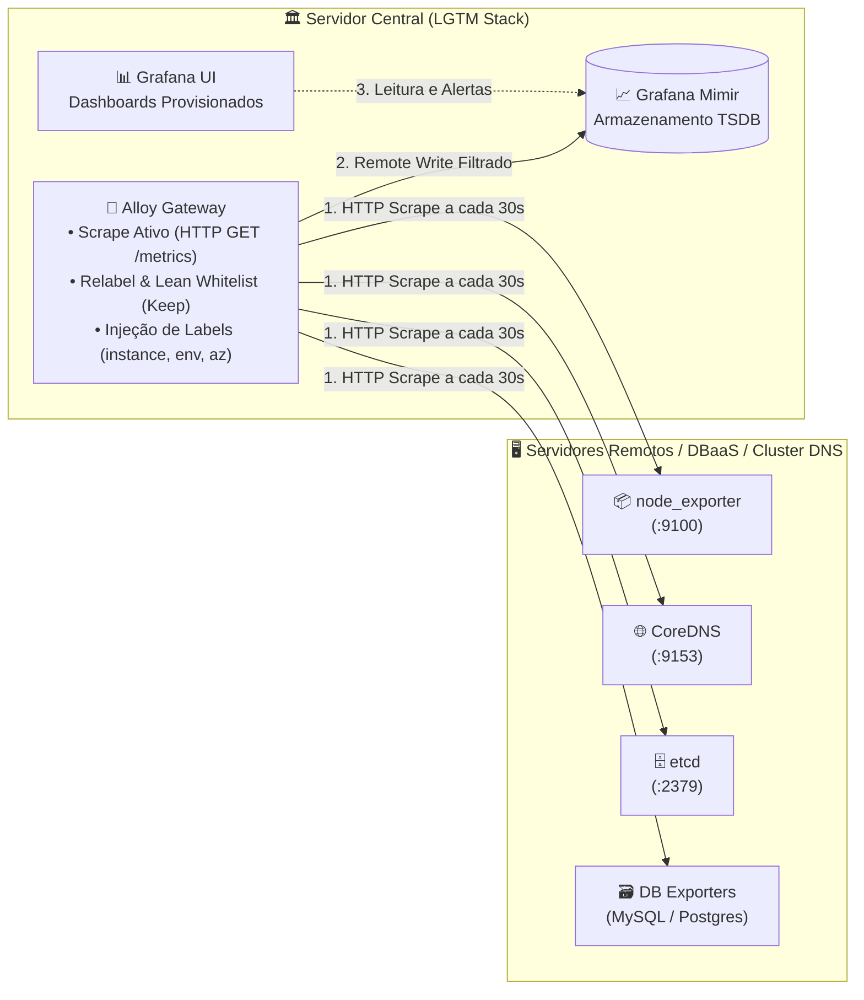

# Guia de Instalação — Coleta Remota (Pull Scrape)

> **Referência Técnica:** Este guia orienta a configuração de coleta ativa de métricas (*Scrape / Modo Pull*) realizada pelo **Alloy Gateway** em servidores remotos, instâncias de banco de dados (DBaaS) e clusters de infraestrutura onde não é possível ou desejável instalar o Alloy Agent local.

---

## 1. Introdução

Em determinados cenários corporativos, a instalação de um agente de observabilidade diretamente no sistema operacional do servidor de destino não é permitida ou viável — como em instâncias de bancos de dados gerenciados (*DBaaS*), servidores legados com políticas estritas de segurança, appliances de rede ou nós dedicados de infraestrutura.

Nesses ambientes, a LGTM Stack utiliza a capacidade de **Scraping Remoto (Modo Pull)** do **Alloy Gateway**: o Gateway realiza requisições periódicas (`HTTP GET /metrics`) nos *exporters* remotos (Node Exporter, CoreDNS, etcd, mysqld_exporter, postgres_exporter, windows_exporter), aplica regras estritas de *Explicit Whitelisting* para descartar métricas irrelevantes e persiste os dados com alta eficiência no Mimir.

---

## 2. Objetivo

1. **Monitorar Hosts sem Agente Local:** Coletar métricas de sistemas operacionais e bancos de dados através de seus endpoints padrão de exportação.
2. **Eliminar Ruído na Ingestão:** Aplicar regras de *relabeling* na entrada do Gateway para persistir estritamente as séries consumidas pelos dashboards.
3. **Padronizar a Ativação de Serviços:** Fornecer templates declarativos e comandos objetivos para inclusão de novos servidores e reinício do container do Gateway.
4. **Viabilizar o Monitoramento da Solução DNS:** Documentar a ativação dos pipelines dedicados para o cluster de DNS interno (*CoreDNS + etcd + Linux*).

---

## 3. Topologia e Como Funciona



---

## 4. Pré-requisitos e Teste de Conectividade de Rede

Antes de configurar os pipelines no Gateway, certifique-se de que o servidor da LGTM Stack possui alcançabilidade de rede até a porta do *exporter* no servidor remoto (através de VPC, VPN ou túnel seguro).

Execute um teste de conexão a partir do host da Stack LGTM:

```bash
# Teste via cURL (deve retornar HTTP/1.1 200 OK)
curl -s -I http://<IP_ADDRESS>:<PORTA>/metrics

# Teste rápido de porta via Netcat (nc)
nc -zv <IP_ADDRESS> <PORTA>
```

> ⚠️ Se o comando falhar com *Connection Refused* ou *Timeout*, revise as regras de firewall (`ufw`/`iptables`) no host remoto e as regras de Security Group da sua nuvem.

---

## 5. Configuração no Alloy Gateway (Servidor LGTM)

### 5.1 Catálogo de Templates Genéricos Disponíveis

A pasta `examples/remote-scrape/` fornece templates parametrizados prontos para uso:

| Template | Carga de Trabalho Monitorada | Porta Padrão |
|---|---|---|
| **`pull-linux-hosts.alloy`** | Linux (Node Exporter - Métricas de SO) | `:9100` |
| **`pull-windows-hosts.alloy`** | Windows Server (Windows Exporter) | `:9182` |
| **`pull-windows-mssql-hosts.alloy`** | Windows Server + Microsoft SQL Server | `:9182` |
| **`pull-linux-dbaas-pgsql-hosts.alloy`** | Linux + Banco de Dados PostgreSQL | `:8080` ou `:9187` |
| **`pull-linux-dbaas-mysql-hosts.alloy`** | Linux + Banco de Dados MySQL / MariaDB | `:8080` ou `:9104` |
| **`pull-coredns-hosts.alloy`** | Servidor DNS CoreDNS | `:9153` |
| **`pull-etcd-hosts.alloy`** | Banco Chave-Valor etcd | `:2379` |

### 5.2 Passo a Passo de Ativação

1. Copie o template desejado para a pasta de configurações ativas do Gateway:
   ```bash
   cp examples/remote-scrape/<nome-do-template>.alloy alloy-gateway/conf.d/
   ```

2. Edite o arquivo copiado dentro de `alloy-gateway/conf.d/` e adicione seus servidores no bloco `targets`:
   * Substitua `[IP_ADDRESS]` pelo endereço IP ou DNS do servidor remoto.
   * Substitua `[INSTANCE_NAME]` pelo nome único da máquina (ex: `srv-db-01`).
   * Ajuste os labels de nuvem (`environment`, `cloud_provider`, `cloud_region`, `cloud_availability_zone`).

3. Reinicie o Alloy Gateway conforme a [Seção 7](#7-como-reiniciar-e-recarregar-o-alloy-gateway) deste guia.

---

## 6. Configuração Específica para a Solução DNS Interno (CoreDNS + etcd + Linux)

Para monitorar um cluster de DNS interno de alta disponibilidade (*CoreDNS + etcd + Sistema Operacional*), este repositório disponibiliza **3 arquivos de configuração pré-definidos**, prontos para uso e parametrizáveis para qualquer região, provedor de nuvem ou infraestrutura local:

* **`pull-linux-dns-hosts.alloy`:** Métricas do Sistema Operacional dos servidores DNS (Node Exporter `:9100`).
* **`pull-coredns-hosts.alloy`:** Métricas de resolução, cache e forward do CoreDNS (`:9153`).
* **`pull-etcd-hosts.alloy`:** Métricas de liderança Raft, storage e disco do etcd (`:2379`).

### 6.1 Mapeamento de Exemplo dos Servidores DNS

Os arquivos vêm parametrizados com slots para 3 instâncias de referência multizona (ajuste os IPs `[IP_ADDRESS]`, nomes `[INSTANCE_NAME]`, região `[REGION]` e zonas `[ZONE]` conforme a sua topologia):

| Servidor / Instância | Endereço IP (Exemplo) | Zona (AZ) | Portas Raspadas |
|---|---|:---:|---|
| **`dns-ne1-1`** | `172.18.1.2` | `a` | `9100` (OS), `9153` (CoreDNS), `2379` (etcd) |
| **`dns-ne1-2`** | `172.18.17.2` | `b` | `9100` (OS), `9153` (CoreDNS), `2379` (etcd) |
| **`dns-ne1-3`** | `172.18.33.2` | `c` | `9100` (OS), `9153` (CoreDNS), `2379` (etcd) |

> 🌐 **Agnóstico de Região e Nuvem:** O label `cloud_region` pode ser ajustado para qualquer região geográfica (ex: `br-ne1`, `br-se1`, `us-east-1`, `local`), e `cloud_provider` para qualquer provedor (`mgc`, `aws`, `gcp`, `azure`, `on-premises`).

### 6.2 Ativação Rápida do Monitoramento DNS

Para ativar a coleta dos servidores de DNS no Alloy Gateway:

```bash
# 1. Copiar os arquivos de DNS para a pasta conf.d do Gateway
cp examples/remote-scrape/pull-linux-dns-hosts.alloy alloy-gateway/conf.d/
cp examples/remote-scrape/pull-coredns-hosts.alloy alloy-gateway/conf.d/
cp examples/remote-scrape/pull-etcd-hosts.alloy alloy-gateway/conf.d/

# 2. Reiniciar o Alloy Gateway para carregar os novos pipelines
docker compose restart alloy-gateway
```

---

## 7. Como Reiniciar e Recarregar o Alloy Gateway

Sempre que adicionar, modificar ou remover arquivos `.alloy` em `alloy-gateway/conf.d/`, aplique os comandos abaixo no servidor central da LGTM Stack:

### 7.1 Reiniciar o Container via Docker Compose

```bash
# Reiniciar o serviço do Alloy Gateway
docker compose restart alloy-gateway
```

### 7.2 Validar os Logs de Inicialização

Acompanhe os logs para garantir que todos os componentes e alvos foram carregados sem erros de sintaxe:

```bash
# Visualizar logs em tempo real
docker compose logs -f alloy-gateway
```

> ✅ Procure pela mensagem `{^_^} Alloy is running` e `now listening for http traffic` nos logs para confirmar o sucesso.

### 7.3 Acessar a Interface Web do Gateway

Abra o navegador em `http://<IP_DO_SERVIDOR_LGTM>:12345` para visualizar o grafo de componentes ativos e conferir o status de cada alvo de *scrape* em tempo real.

---

## 8. Configuração dos Exporters nos Servidores Remotos

### 8.1 Ambientes Linux (node_exporter)
1. Instale o [node_exporter](https://github.com/prometheus/node_exporter).
2. Execute o serviço expondo a porta `:9100` para a rede do Gateway:
   ```bash
   sudo systemctl enable --now node_exporter
   ```

### 8.2 Ambientes Windows Server (windows_exporter)
1. Instale o [windows_exporter](https://github.com/prometheus-community/windows_exporter).
2. No arquivo `config.yml`, ative os coletores suportados pela stack:
   ```yaml
   collectors:
     enabled: cpu,logical_disk,memory,net,os,system,pagefile
   ```
3. Inicie o serviço:
   ```powershell
   .\windows_exporter.exe --config.file=config.yml
   ```

### 8.3 Ambientes Windows Server + SQL Server (MSSQL)
1. No arquivo `config.yml`, adicione o coletor `mssql`:
   ```yaml
   collectors:
     enabled: cpu,logical_disk,memory,net,os,system,mssql,pagefile
   ```
2. Inicie o serviço expondo a porta `:9182`.

### 8.4 Ambientes Linux + DBaaS PostgreSQL
Para instâncias PostgreSQL monitoradas via proxy reverso ou exporters dedicados:
* **Node Exporter (SO):** `http://<IP_ADDRESS>:8080/node/metrics` (ou porta `9100`).
* **Postgres Exporter (DB):** `http://<IP_ADDRESS>:8080/postgres/metrics` (ou porta `9187`).

### 8.5 Ambientes Linux + DBaaS MySQL
* **Node Exporter (SO):** `http://<IP_ADDRESS>:8080/node/metrics` (ou porta `9100`).
* **MySQL Exporter (DB):** `http://<IP_ADDRESS>:8080/mysql/metrics` (ou porta `9104`).

---

## 9. Validação e Testes de Ingestão

Após reiniciar o Gateway, valide se as métricas estão sendo gravadas no Mimir:

1. **Consulta de Vivacidade (Status UP):**
   ```bash
   # Executar consulta no Mimir via container do Grafana
   docker exec grafana curl -sG "http://mimir:9009/prometheus/api/v1/query" \
     --data-urlencode 'query=up{instance="<INSTANCE_NAME>"}'
   ```
   > Confirme o retorno de `"result":[{"metric":{...},"value":[...,"1"]}]`.

2. **Verificação nos Dashboards do Grafana:**
   * Acesse `http://localhost:3000` e abra o dashboard correspondente:
     * `Hosts > Linux Hosts` ou `Windows Hosts`
     * `Hosts + Database > Linux + MySQL Hosts` ou `Linux + PostgreSQL Hosts`
     * `DNS > MGC Internal DNS`

---

## 10. Testes de Carga e Simulação de Stress

Para validar o comportamento dos dashboards e alertas sob estresse de hardware e banco de dados:

* **Simulação de Carga em PostgreSQL:**
  ```bash
  psql -h <IP_ADDRESS> -U postgres -f artifacts/load-test/postgres-load-test.sql
  ```
* **Simulação de Carga em MySQL:**
  ```bash
  mysql -h <IP_ADDRESS> -u root -p < artifacts/load-test/mysql-load-test.sql
  ```
* **Simulação de Carga em DNS (CoreDNS + etcd):**
  ```bash
  bash artifacts/load-test/dns-load-test.sh
  ```

👉 Para detalhes de locks, throughput e tuning, consulte [artifacts/load-test/LOAD-TEST.md](../../artifacts/load-test/LOAD-TEST.md).

---

## 11. Governança e Referências

* Para dimensionamento de memória e retenção, consulte [docs/SIZING.md](../../docs/SIZING.md).
* Para políticas de allowlisting e métricas, consulte [docs/METRICS.md](../../docs/METRICS.md).
* Para gerenciamento de dashboards GitOps, consulte [docs/DASHBOARDS.md](../../docs/DASHBOARDS.md).
* Para topologia de rede e segurança, consulte [docs/ARCHITECTURE.md](../../docs/ARCHITECTURE.md).

---
🔙 Voltar: [README Principal](../../README.md)
