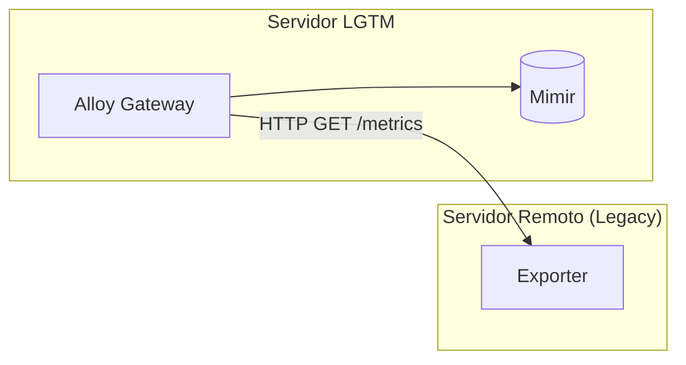

# Guia de Instalação — Coleta Remota (Pull Scrape)

Este guia mostra como configurar a coleta de métricas em servidores onde não é possível instalar o Alloy Agent localmente. Nesse cenário, o **Alloy Gateway** assumirá o papel de fazer o *scrape* ativo (modelo Pull), buscando os dados diretamente nos *exporters* remotos.

---

## Como funciona a arquitetura



O Alloy Gateway atua como intermediário: ele faz a coleta das métricas, aplica regras rígidas de *relabeling* para descartar todo o ruído (whitelist) e, então, encaminha apenas os dados essenciais e validados para o Mimir.

---

## Passo Zero: Teste de Conectividade

**Atenção:** Antes de começar a configuração, é fundamental garantir que o servidor da Stack LGTM consiga acessar o *endpoint* de métricas do servidor remoto.

Para evitar horas de *troubleshooting* com falhas de rede que parecem problemas de infraestrutura, faça um teste rápido usando `curl` ou `wget` a partir do servidor LGTM:

```bash
# Teste de conexão via cURL
curl -s -I http://<IP_ADDRESS>:<PORTA>/metrics

# Teste de conexão via Wget
wget -q -S -O /dev/null http://<IP_ADDRESS>:<PORTA>/metrics
```

Se a resposta retornar um código HTTP `200 OK`, a comunicação está perfeita. Caso o comando falhe (por exemplo, com erro de *Connection Refused* ou *Timeout*), verifique as regras de firewall, security groups da sua cloud ou confira se o serviço do *exporter* está rodando corretamente no servidor de origem.

---

## 1. Configurando o Gateway (Servidor LGTM)

1. Selecione o *template* que melhor corresponde ao que você quer monitorar:
   * `pull-linux-hosts.alloy` — Linux (apenas métricas de Sistema Operacional)
   * `pull-windows-hosts.alloy` — Windows (apenas métricas de Sistema Operacional)
   * `pull-windows-mssql-hosts.alloy` — Windows Server com Microsoft SQL Server
   * `pull-linux-dbaas-pgsql-hosts.alloy` — Linux com banco de dados PostgreSQL
   * `pull-linux-dbaas-mysql-hosts.alloy` — Linux com banco de dados MySQL

2. Copie o arquivo escolhido para a pasta de configurações do Gateway:
   ```bash
   cp examples/remote-scrape/<nome-do-template>.alloy alloy-gateway/conf.d/
   ```

   *Dica de infra: Se o servidor LGTM tiver regras de rede muito restritas que impeçam o clone do repositório Git diretamente da internet, você pode copiar o arquivo `.alloy` a partir da sua própria máquina usando o `scp` (cópia segura via SSH):*
   ```bash
   scp examples/remote-scrape/<nome-do-template>.alloy <usuario>@<IP_LGTM_SERVER>:/caminho/absoluto/lgtm-stack/alloy-gateway/conf.d/
   ```

3. Agora, edite o arquivo que foi copiado em `alloy-gateway/conf.d/` para adicionar as informações do seu servidor no bloco `targets`:
   - Substitua o marcador `[IP_ADDRESS]` pelo endereço IP ou DNS válido do host.
   - Substitua o marcador `[INSTANCE_NAME]` por um nome descritivo (ex: `srv-app-01`) para identificar fácil essa máquina nos painéis.
   - **Nota sobre labels de infraestrutura:** Os campos `environment`, `cloud_provider`, `cloud_region` e `cloud_availability_zone` vêm preenchidos com valores padrão para produção no **Magalu Cloud (MGC)** na região `br-se1` zona `a`. Altere esses valores caso seu servidor esteja em um ambiente ou provedor diferente.

4. Pronto! O Alloy Gateway vai recarregar a configuração sozinho de forma dinâmica.

---

## 2. Configurando os Exporters (Servidor Remoto)

Para que as métricas se encaixem direitinho nos painéis da stack LGTM, inicie os coletores de acordo com as especificações a seguir.

### Ambientes Windows (Apenas Host)
1. Instale o [windows_exporter](https://github.com/prometheus-community/windows_exporter).
2. Configure o arquivo `config.yml` ativando apenas estes coletores:
```yaml
collectors:
  enabled: cpu,logical_disk,memory,net,os,system,pagefile
```
3. Inicie o serviço:
```powershell
.\windows_exporter.exe --config.file=config.yml
```

### Ambientes Windows Server + SQL Server (MSSQL)
1. Ajuste o arquivo `config.yml` habilitando também o coletor do mssql:
```yaml
collectors:
  enabled: cpu,logical_disk,memory,net,os,system,mssql,pagefile
```
2. Inicie o serviço:
```powershell
.\windows_exporter.exe --config.file=config.yml
```

### Ambientes Linux (node_exporter)
1. Instale o [node_exporter](https://github.com/prometheus/node_exporter).
2. Execute o binário utilizando os parâmetros padrão da ferramenta:
```bash
./node_exporter
```

### Ambientes Linux + DBaaS PostgreSQL
Para servidores com PostgreSQL monitorados pelo template `pull-linux-dbaas-pgsql-hosts.alloy`, garanta que as rotas de métricas estejam expostas corretamente (é muito comum elas estarem atrás de um proxy reverso na porta `8080`):
- **Sistema Operacional (Node Exporter):** `http://<IP_ADDRESS>:8080/node/metrics`
- **Banco de Dados (Postgres Exporter):** `http://<IP_ADDRESS>:8080/postgres/metrics`

*Nota: Se o seu ambiente utilizar as portas de comunidade padrão (ex: `9100` para node_exporter e `9187` para postgres_exporter rodando em `/metrics`), basta alterar as linhas de `__address__` e `__metrics_path__` diretamente dentro do arquivo `.alloy`.*

### Ambientes Linux + DBaaS MySQL
Para instâncias MySQL monitoradas pelo template `pull-linux-dbaas-mysql-hosts.alloy`, as rotas também devem estar configuradas para exposição:
- **Sistema Operacional (Node Exporter):** `http://<IP_ADDRESS>:8080/node/metrics`
- **Banco de Dados (MySQL Exporter):** `http://<IP_ADDRESS>:8080/mysql/metrics`

*Nota: O template é voltado para o motor InnoDB (padrão MySQL 8.0+). Essas métricas foram parametrizadas usando a estratégia de Explicit Whitelisting para entregar o mesmo nível de qualidade e baixo consumo de armazenamento do template PostgreSQL.*

---

## 3. Validando a Configuração

Terminou de configurar as duas pontas? Faça um teste rápido para ver se as métricas já estão chegando no banco de dados.

1. **Consulta (Query Ingestion):** Execute uma busca via API no Mimir para confirmar o recebimento dos dados base:
   ```bash
   docker exec grafana curl -sG "http://mimir:9009/prometheus/api/v1/query" \
     --data-urlencode 'query=up{instance="<INSTANCE_NAME>"}'
   ```
   > A imagem do Grafana não tem `jq` instalado — o comando retorna o JSON
   > bruto. Procure por `"result":[...]` não vazio para confirmar que os
   > dados chegaram.

---

## 3.1 Dashboard MySQL — Filtrando por Database

Ao acessar o dashboard **Linux + MySQL Hosts**, você verá dois filtros de busca no topo da página:

- **Instance:** Lista preenchida de forma automática com todas as instâncias descobertas (usando a função `label_values(mysql_up, instance)`).
- **Database:** Uma lista construída manualmente de bancos disponíveis.

### Como gerenciar o filtro de Bancos de Dados

O `mysqld_exporter` infelizmente não envia o nome do banco de dados (label `database`) atrelado a todas as métricas do sistema. Por esse motivo, o filtro *Database* do painel precisou ser configurado de forma declarativa (ou seja, é uma lista que você precisa atualizar na mão).

Os valores padrão já configurados são:
```text
information_schema, mysql, performance_schema, lgtm
```

Para **adicionar novos bancos ou remover os antigos**, basta fazer isso pela interface do Grafana:
1. Abra o dashboard **Linux + MySQL Hosts** e acesse a Engrenagem no menu superior (⚙️ **Settings**) → **Variables**.
2. Clique na variável `database`.
3. Edite o campo **Options** adicionando ou removendo os nomes separados por vírgula.
4. Salve clicando no botão verde **Save dashboard**.

---

## 4. Testes de Carga (Stress Testing)

Quer testar se o monitoramento consegue medir corretamente um pico de uso de CPU e banco de dados em tempo real? Simule atividades pesadas rodando os comandos abaixo:

### Simulando carga no PostgreSQL
```bash
psql -h <IP_ADDRESS> -U postgres -f postgres-load-test.sql
```

### Simulando carga no MySQL
```bash
mysql -h <IP_ADDRESS> -u root -p < mysql-load-test.sql
```

Para entender melhor sobre diagnósticos de lentidão, locks e troubleshooting baseando-se nos painéis:
👉 **[Guia de Testes de Carga (LOAD-TEST.md)](../../artifacts/load-test/LOAD-TEST.md)**

---

## 5. Dimensionamento e Retenção (Capacity Planning)

Para ver as fórmulas de volume de dados armazenados, impacto das métricas de whitelist e recursos sugeridos de hardware:
👉 **[Documentação de Sizing (SIZING.md)](../../SIZING.md)**
