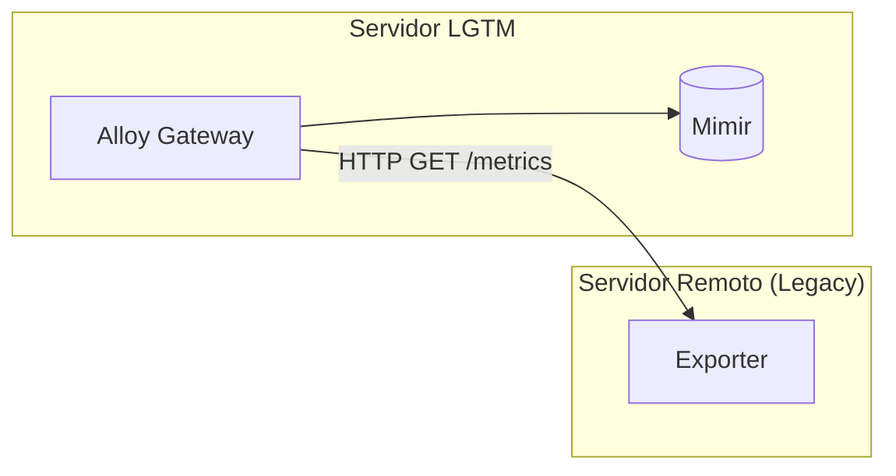

# Coleta Remota (Pull Scrape) — Guia de Instalação

Este guia descreve como configurar a coleta de métricas em servidores onde não é possível instalar o Alloy Agent nativamente. O **Alloy Gateway** realizará o scrape ativo (Pull) nos exporters remotos.

---

## Como funciona



O Gateway faz o scrape, filtra o "lixo" via relabeling e encaminha os dados higienizados para o Mimir.

---

## 1. Preparação no Gateway (Servidor LGTM)

1. Escolha o template adequado nesta pasta:
   * `pull-linux-hosts.alloy` — Linux (apenas SO)
   * `pull-windows-hosts.alloy` — Windows (apenas SO)
   * `pull-windows-mssql-hosts.alloy` — Windows + SQL Server
   * `pull-linux-dbaas-pgsql-hosts.alloy` — Linux + PostgreSQL
   * `pull-linux-dbaas-mysql-hosts.alloy` — Linux + MySQL


2. Copie para o diretório de configuração do Gateway:
   ```bash
   cp examples/remote-scrape/<nome-do-template>.alloy alloy-gateway/conf.d/
   ```

3. Edite o arquivo em `alloy-gateway/conf.d/` para incluir o IP e nome do seu servidor na lista `targets`.

4. O Gateway recarregará a configuração automaticamente.

---

## 2. Configuração dos Exporters (Servidor Remoto)

Para garantir que as métricas sejam compatíveis com os dashboards da stack, configure os coletores conforme abaixo.

### Windows (Apenas Host)
1. Instale o [windows_exporter](https://github.com/prometheus-community/windows_exporter).
2. Utilize o arquivo de configuração `config.yml`:
```yaml
collectors:
  enabled: cpu,logical_disk,memory,net,os,system,pagefile
```
3. Inicie o serviço:
```powershell
.\windows_exporter.exe --config.file=config.yml
```

### Windows + SQL Server (MSSQL)
1. Utilize o arquivo de configuração `config.yml`:
```yaml
collectors:
  enabled: cpu,logical_disk,memory,net,os,system,mssql,pagefile
```
2. Inicie o serviço:
```powershell
.\windows_exporter.exe --config.file=config.yml
```

### Linux (node_exporter)
1. Instale o [node_exporter](https://github.com/prometheus/node_exporter).
2. Execute com os coletores padrão:
```bash
./node_exporter
```

### Linux + DBaaS PostgreSQL (node_exporter + postgres_exporter)
Para ambientes rodando bancos de dados PostgreSQL junto com o sistema operacional Linux, utilizando o template `pull-linux-dbaas-pgsql-hosts.alloy`, garanta que os seguintes endereços de acesso às métricas estejam expostos e corretamente mapeados (tipicamente via um proxy/ingress na porta `8080`):
- **Node Exporter (SO):** `http://<IP-REMOTO>:8080/node/metrics`
- **Postgres Exporter:** `http://<IP-REMOTO>:8080/postgres/metrics`

*Nota: Se as portas ou paths originais forem utilizados nativamente (como 9100 e 9187 com o path `/metrics`), lembre-se de ajustar as configurações de `__address__` e `__metrics_path__` no próprio arquivo `.alloy` de acordo.*

### Linux + DBaaS MySQL (node_exporter + mysqld_exporter)
Para ambientes rodando bancos de dados MySQL junto com o sistema operacional Linux, utilizando o template `pull-linux-dbaas-mysql-hosts.alloy`, garanta que os seguintes endereços de acesso às métricas estejam expostos e corretamente mapeados (tipicamente via um proxy/ingress na porta `8080`):
- **Node Exporter (SO):** `http://<IP-REMOTO>:8080/node/metrics`
- **MySQL Exporter:** `http://<IP-REMOTO>:8080/mysql/metrics`

*Nota: O template coleta métricas de InnoDB (motor padrão do MySQL 8.0+). Para referência sobre o mapeamento de métricas entre PostgreSQL e MySQL, consulte [MYSQL_POSTGRES_METRICS_MAPPING.md](./MYSQL_POSTGRES_METRICS_MAPPING.md).*

---

## 3. Verificação

Após configurar o exporter e o gateway, valide a coleta:

1. **Conectividade:** Do servidor LGTM, teste o acesso:
   ```bash
   curl -s http://<IP-REMOTO>:<PORTA>/metrics | head -n 5
   ```

2. **Ingestão:** Verifique se os dados chegaram ao Mimir:
   ```bash
   docker exec grafana curl -sG "http://mimir:9009/prometheus/api/v1/query" \
     --data-urlencode 'query=up{instance="<nome-do-host>"}' | jq '.data.result'
   ```

---

## 4. Teste de Carga (Validação de Métricas)

Após a configuração estar estável, você pode executar testes de carga para validar a coleta de métricas em cenários realistas:

### PostgreSQL

```bash
psql -h 172.18.1.157 -U postgres -f postgres-load-test.sql
```

### MySQL

```bash
mysql -h 192.168.1.13 -u root -p < mysql-load-test.sql
```

Para instruções detalhadas, guia de troubleshooting e como interpretar métricas:
👉 **[LOAD-TEST.md](../../load-test/LOAD-TEST.md)**

---

## 5. Dimensionamento (Sizing)

Para cálculos de projeção de disco e cardinalidade, consulte:
👉 **[SIZING.md](../../SIZING.md)**
